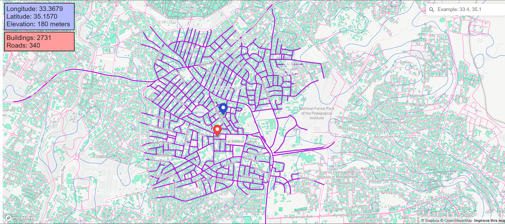

# Mapbox GIS Prototype

This repository contains a browser-based GIS prototype built with Mapbox GL JS and plain JavaScript. The project was developed as part of student work at the KIOS Research and Innovation Center of Excellence, University of Cyprus, and focuses on visualizing buildings, roads, and terrain information on top of a Mapbox basemap.

The application combines local GeoJSON datasets with Mapbox services to support map exploration, coordinate search, road and building counts around a selected point, and elevation lookup within a 1 km radius.

Live demo: https://larkoss.github.io/mapbox/

The live site uses a smaller Nicosia-only demo dataset so it can be hosted directly on GitHub Pages. The original full Cyprus GeoJSON files are still included in the repository for reference and preprocessing.



## Project Summary

Based on the development notes in the logbook, the work progressed in roughly these stages:

- Experimenting first with Mapbox-provided 3D building data.
- Collecting building datasets from Cyprus government sources.
- Converting source data from GML to GeoJSON so it could be rendered in the browser.
- Reducing unnecessary GeoJSON properties and adjusting precision to make the datasets lighter and easier to load.
- Adding custom layers for buildings, roads, and contour lines.
- Implementing interaction logic for counting nearby buildings and roads.
- Adding an elevation query that finds and marks the highest point within a 1 km radius of a clicked location.

## Features

The current version of the project includes:

- A Mapbox basemap centered on Cyprus.
- A buildings layer loaded from a local GeoJSON dataset.
- A roads layer loaded from a local GeoJSON dataset.
- Terrain contour lines from the Mapbox terrain tileset.
- Coordinate search using the Mapbox Geocoder control.
- Click interaction that places a marker on the selected location.
- Counting of nearby buildings and roads around the clicked point.
- Highlighting of the selected buildings and roads.
- Elevation lookup that finds the highest nearby terrain point and marks it on the map.
- On-screen info panels for longitude, latitude, elevation, building count, and road count.

## Data Workflow

- Source building data was available in GML format.
- Intermediate converted files were stored as GeoJSON.
- Final rendered data was prepared in WGS84 GeoJSON for direct use in the web map.

Relevant project files:

- `buildingsGML/`: original building data in GML format.
- `buildingsGEOJSON/`: converted GeoJSON building files.
- `buildingsWGS84.geojson`: main buildings dataset used by the app.
- `roadnetwork_original.geojson`: main roads dataset used by the app.
- `buildings_nicosia_demo.json`: smaller Nicosia buildings dataset used by the deployed demo.
- `roads_nicosia_demo.json`: smaller Nicosia roads dataset used by the deployed demo.

## Running Locally

This is a static frontend project, so you do not need `npm install`.

Run a local server from the repository root:

```powershell
cd C:\Users\User\Documents\mapbox
python -m http.server 8000
```

Then open:

```text
http://localhost:8000/index.html
```
